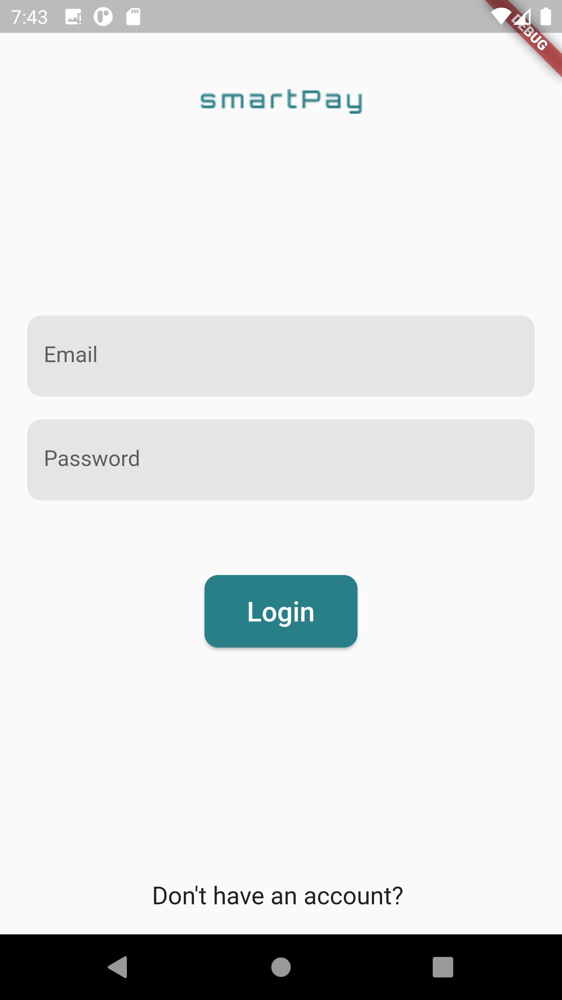
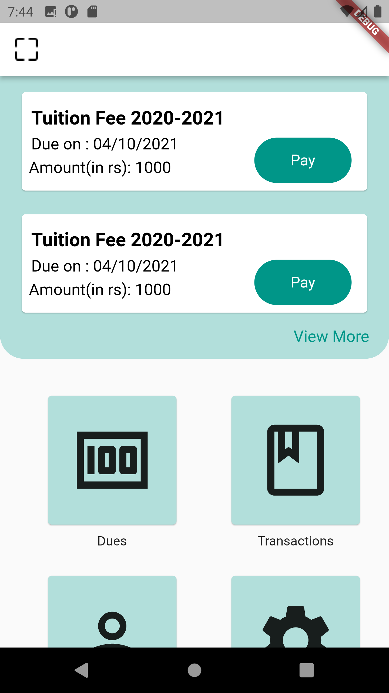

# SmartPay

A new Flutter payment application specially designed for students and institutions for fee payment (both tution and hostel fee).

## Problem statement

Managing fee payments is a task that requires a lot of effort for educators and institutions. In a large institution or University, communication regarding fee payment is passed from higher authorities to lower ones and students. A student representative will collect cash from classmates. Any small mistake can lead to financial loss. A lot of paperwork and communication is required. To avoid these difficulties, we have designed and developed an application for educators and students to manage fee payments. This will eliminate a lot of manual work. Institutions can notify students instantly and generate reports automatically.

## Personas of the system

The major users of our flutter application and their benefits are as follows:-

-Institutions

     -Institutions can manage payments of its student in an easier way.
     -Create a payment instantly and notify students.
     -Generate Report on one click
     -No need of creating spreadsheets and cross checking.
     -Tracking of payment is very much easier.
     
     
 -Students
 
 
       -Get notified about due payments.
       -Can pay their fees by one click.
       -Can see all transaction made with the Institution.
       -Liquid money is not involved .So the risk of losing money can be eliminated.

## Architecture

 

## List of contributors

- Dona Mathew,RIT Kottayam
- Mohammed Mikdhad C,RIT Kottayam
- Nikitha Raj,RIT Kottayam
- Sruthy J Mallya,RIT Kottayam

## Getting Started

There are several folders in this repository.Please find the below description for easy understanding of our project work flow.

-android/ : The Android folder contains files and folders required for running the application on an Android operating system. These files and folders are autogenerated during the creation of the flutter project. It's recommended that these folders and files are left as is.

-assets/ : Contain the images files used in the project.

-demo/ : Contains a drive link to video presentation of our prototype.

-ios/  : The ios folder contains files and folders required for running the application on an ios operating system. These files and folders are autogenerated during the creation of the flutter project. It's recommended that these folders and files are left as is.

-lib/ : Contains the dart code of the project UI.

-presentation/ : Contains some slides explaining the features,users and challenges of the project.

-test/ : Contains files for unit testing of the application.

-web/ : Contains files for flutter web development.

-pubspec.yaml :Every pub package needs some metadata so it can specify its dependencies. Pub packages that are shared with others also need to provide some other information so users can discover them. All of this metadata goes in the package’s pubspec: a file named pubspec.yaml that’s written in the YAML language.

